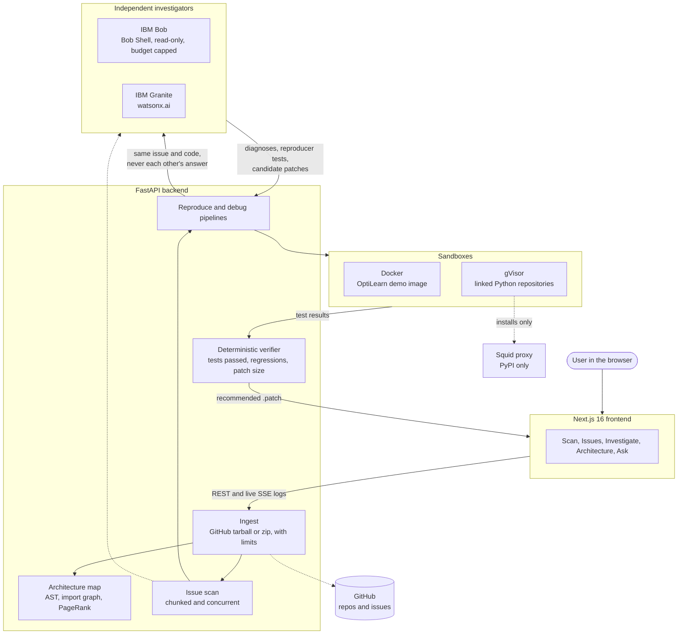
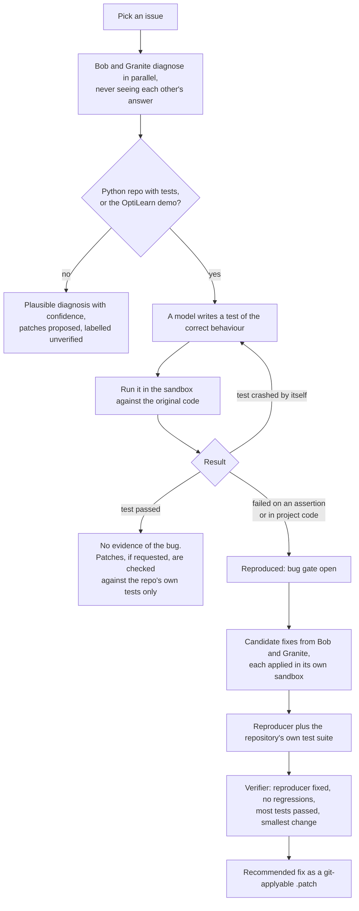

# Medusa

**AI tools hand you fixes, not proof.** Medusa maps your codebase, reproduces the bug in a
sandbox, and races fixes from IBM Bob and IBM Granite against real tests, so the evidence
decides, not the model.

Live demo: **https://18-141-113-159.sslip.io**
Built for the IBM Bob 2.0 Hackathon (lablab.ai, 25 to 27 September 2026).

## What it does

Point Medusa at a public GitHub repository or upload a zip, then:

1. **Map.** A static-analysis pass parses the source, builds the import graph, ranks files with
   PageRank and draws an architecture diagram with the tech stack, entry points and external
   services. No model is involved and nothing is executed. Large repositories get a partial map
   with a stated reason.
2. **Investigate.** Issues come from Medusa's own scan and the repository's real GitHub Issues.
   Two independent investigators work each one in parallel and never see each other's answer:
   IBM Bob (Bob Shell, headless and read-only) and IBM Granite on watsonx.ai.
3. **Prove.** For Python repositories with tests, a model writes a test of the correct behaviour
   and Medusa runs it in an isolated gVisor sandbox. The bug counts as reproduced only if that
   test fails on the original code. Candidate fixes from both models then race in their own
   sandboxes against the reproducer and the repository's own test suite, and a deterministic
   verifier picks the winner. The built-in OptiLearn demo does the same in a locked-down Docker
   sandbox.
4. **Ask.** A chat bar answers questions about the repository or an issue, citing files and lines.

## Evidence over confidence

| Rule | How Medusa enforces it |
| --- | --- |
| "Reproduced" and "passed" need proof | Shown only after a sandbox run says so |
| A broken test is not evidence | A reproducer that crashes by itself (missing file, bad import) never counts; only a failed assertion or an exception from the project's own code does |
| No invented bugs | If a test of the correct behaviour passes, Medusa reports no evidence of the bug instead of forcing a failing test |
| No harmful patches | A patch that breaks the repository's existing tests is never recommended |
| Models propose, code decides | Model confidence is shown but never used to rank; `pipelines/verify.py` ranks by tests passed, then smallest change |
| Honest labels | Anything not run is labelled plausible, with a confidence score, and every failure is shown with its real reason |

## Architecture



### Reproduce and debug flow



### Sandboxes

Two threat models, two sandboxes. Nothing from a linked repository ever runs on the host.

| | OptiLearn demo | Linked Python repositories |
| --- | --- | --- |
| Runtime | Docker, prebuilt image with dependencies baked in | gVisor (`runsc`), a user-space kernel; any other runtime is refused |
| Network | None | Install phase: an internal network whose only exit is a PyPI-only proxy. Test phase: none |
| Filesystem | Read-only root, small tmpfs, read-only code | Read-only root, a private per-run snapshot of the repo, dependencies in a size-capped RAM volume |
| Limits | 512 MB memory, 0.5 CPU, 256 processes, 90 s | 1 GB memory, 1 CPU, 512 processes, 300 s install, 180 s tests, capped log output |
| Identity | Non-root, all capabilities dropped, no-new-privileges | Same, plus no credentials or host environment and no route to the instance metadata service |
| Patches | Spliced into a copy of the target function | Applied inside the container, never on the host |

General-repository execution sits behind the `ARBITRARY_EXECUTION` setting and is enabled on the
public demo after a security review.

## IBM Bob and IBM Granite

**IBM Bob** runs live inside the product through Bob Shell (`bob run --format json --mode ask`)
with the edit, execute, MCP, subagent and skill tool groups disabled. It sees only a throwaway
copy of the relevant files, and its process gets nothing but `PATH`, `HOME` and an
inference-scoped key. Each run is capped by `BOB_MAX_COST` (0.25 Bobcoins) and `BOB_MAX_TURNS`
(6), and a server-wide daily budget (`BOB_DAILY_BUDGET`) is reserved before every run and settled
after. Bob diagnoses issues, proposes fixes that fill up to half the debug race, and scans code and
writes reproducer tests when Granite is unavailable.

**IBM Granite** (`ibm/granite-4-h-small` on watsonx.ai) scans repositories in concurrent chunks,
diagnoses issues independently of Bob, proposes patches, writes reproducer tests and gets one
revision round when its patch fails a test. Prompts ask for JSON only, validated against typed
schemas, with caching and retries.

If either model is unavailable (not configured, quota used up, authentication, cost or turn
limit), the other carries on and the UI shows the real reason. With neither, labelled prepared
candidates are used on the demo.

## Tech stack

| Layer | Technology |
| --- | --- |
| Frontend | Next.js 16 (App Router), React 19, TypeScript, Tailwind CSS 4, Mermaid, prism-react-renderer |
| Backend | FastAPI, Python 3.12, Pydantic v2, httpx, Server-Sent Events |
| AI | IBM Bob (Bob Shell), IBM Granite on watsonx.ai |
| Sandboxes | Docker, gVisor, Squid |
| Hosting | AWS EC2, nginx, systemd, GitHub Actions with OIDC deploys |
| Quality | pytest, ruff, TypeScript |

## Running locally

Needs Python 3.12+, Node 22.15+ and Docker. For Bob, install Bob Shell:
`curl -fsSL https://bob.ibm.com/download/bobshell.sh | bash`

```bash
# Sandbox image for the OptiLearn demo
docker build -t medusa-optilearn:latest sandbox/optilearn

# Backend
cd backend
python3 -m venv .venv && source .venv/bin/activate
pip install -r requirements.txt
cp .env.example .env        # fill in IBM_WATSONX_* and BOB_API_KEY (each optional)
uvicorn app.main:app --reload --port 8000

# Frontend, in a second terminal
cd frontend
npm install
cp .env.example .env.local
npm run dev                 # http://localhost:3000
```

To try general-repository execution locally, build the runner image
(`docker build -t medusa-pyrunner:latest sandbox/pyrunner`) and set `ARBITRARY_EXECUTION=true`.
Without gVisor installed, development also needs `EXEC_RUNTIME=runc` and
`EXEC_ALLOW_UNSANDBOXED_RUNTIME=true`; never use those settings on a public server.

Tests and lint:

```bash
cd backend && pytest && ruff check . && ruff format --check .
cd frontend && npm run typecheck && npm run build

# Real-container tests for the gVisor sandbox (need Docker, the runner image and PyPI access)
cd backend && MEDUSA_EXEC_INTEGRATION=1 pytest tests/test_pyexec.py
```

## Project structure

```
medusa/
├── backend/app/
│   ├── api/            scan, runs (reproduce, debug, SSE, downloads), architecture, ask, health
│   ├── pipelines/      scan, repro, debug, verify, execution, architecture, ask, context
│   ├── agents/         bob (Bob Shell), bob_budget, granite (watsonx.ai), panel (runs both),
│   │                   reproducer, investigators, fixers, results
│   ├── sandbox/        runner.py (OptiLearn, Docker), pyexec.py (linked repos, gVisor)
│   ├── architecture/   AST extraction, import graph, PageRank, Mermaid output
│   ├── ingest/         GitHub tarball and zip ingest with limits and safe extraction
│   ├── demo/           OptiLearn scenario and demo scan
│   └── models/contracts.py   data contracts, mirrored in frontend/lib/api.ts
├── sandbox/
│   ├── optilearn/      demo image: OptiLearn subset, reproducer harness, prepared fixes
│   ├── pyrunner/       runner image and harness for linked Python repositories
│   └── egress-proxy/   PyPI-only Squid configuration
├── frontend/           Next.js app: scan, issues, investigate, architecture, recent scans
├── deploy/             setup.sh, deploy.sh, nginx, systemd units, deploy guide
└── bob_sessions/       Bob IDE session evidence
```

## Limits

| Limit | Value |
| --- | --- |
| Zip upload | 20 MB, 2,000 files; symlinks and paths outside the archive are rejected |
| GitHub repository | Public, up to 50 MB |
| Scan | Up to 40 files and 6,000 lines; vendored, built and minified files are skipped |
| Rate limits per IP | 5 scans and 6 reproduce or debug runs per 10 minutes |
| Retention | Scans and runs live in memory for 30 minutes and are lost on a server restart |

## Deploying

See [deploy/README.md](deploy/README.md). One Ubuntu EC2 instance; `deploy/setup.sh` installs
everything, and every push to `main` that passes CI is deployed automatically through GitHub OIDC.
