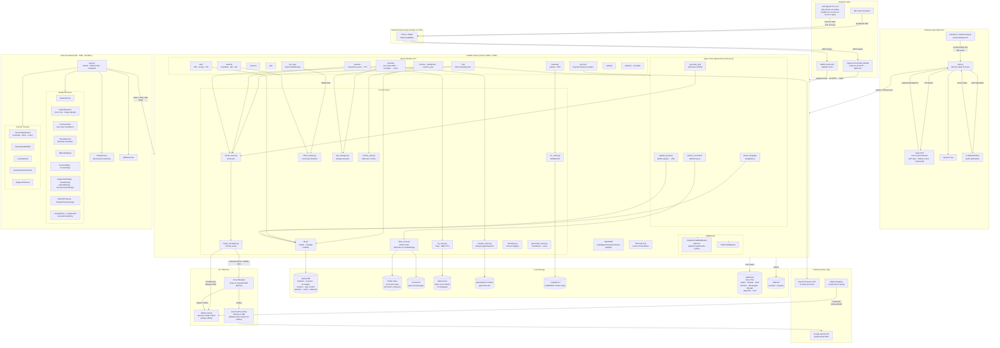

## Opti Learn Architecture

```mermaid
graph TD
    subgraph DESKTOP["Desktop Layer (Electron)"]
        MAIN["main.js\nElectron Main Process"]
        SETUP["setup.html\nFirst-Launch Wizard\n(API keys · Ollama check · model pull)"]
        PRELOAD["preload.js / preload-setup.js\nContext-Bridge IPC"]
        TRAY["System Tray"]
        LOADER["Loading Window\n(polls /api/health)"]
    end

    subgraph STUDENT_DEVICES["Student Devices (any browser on LAN)"]
        PHONE["Phone / Tablet\nPWA (installable)"]
    end

    subgraph NETWORK["Network Layer"]
        MDNS["mDNS (zeroconf)\noptilearn.local"]
        DNS["Captive Portal DNS (dnslib)\nredirects all HTTP → OptiLearn"]
        QR["QR Code enrollment"]
        TLS["Self-signed TLS cert\n(all LAN IPs as SANs)\nenables mic access on HTTPS :8443"]
    end

    subgraph SERVER["FastAPI Server (uvicorn :8000 / :8443)"]
        direction TB

        subgraph MIDDLEWARE["Middleware"]
            CAPTIVE_MW["CaptivePortalMiddleware\nredirects Apple/Google/Firefox probes"]
            CORS["CORS Middleware"]
        end

        subgraph ROUTES["Route Modules (17)"]
            R_AUTH["auth\nJWT · bcrypt · PIN"]
            R_CHAT["chat\nSSE streaming tutor"]
            R_SESS["sessions"]
            R_QUIZ["quiz"]
            R_F1["feature1\nTranslate & Learn · TTS"]
            R_TRANS["translate\nLive Class ASR → translate → notes"]
            R_LQHOST["live_quiz\nKahoot WebSocket"]
            R_TEACH["teacher · dashboard · teacher_quiz"]
            R_MAT["materials\nupload · OCR"]
            R_PERSONA["persona\nBeyond Presence avatars"]
            R_NET["network\nheartbeat · QR · info"]
            R_SETTINGS["settings"]
            R_STUD["students · schedule"]
        end

        subgraph SERVICES["Core Services"]
            MC["model_client.py\nAI Router"]
            SCHED["model_scheduler.py\nPriority Lanes"]
            FAISS["faiss_store.py\nFAISS index\n(MiniLM-L12 embeddings)"]
            DB["db.py\nSQLite · aiosqlite\n8 tables"]
            TTS["tts_client.py\nPiper · MMS-TTS"]
            ASR["whisper_client.py\nWhisper ggml-base.bin"]
            OCR["ocr_client.py\nPaddleOCR"]
            TRACKER["client_tracker.py\nconnected students"]
            JOBS["job_manager.py\nbackground jobs"]
            TELEM["telemetry.py\nAI trace logging"]
            CACHE["generated_cache.py\ntranslations · notes"]
            CTX["context_prep.py\nbuild tutor context"]
        end

        subgraph TOOLS["Agent Tools (dispatched at inference)"]
            T1["detect_language\n(langdetect)"]
            T2["retrieve_curriculum\n(FAISS top-3)"]
            T3["generate_quiz\n(structured JSON)"]
            T4["update_progress\n(EMA mastery → DB)"]
        end

        HEALTH["/api/health\n/api/diagnostics/performance\n/api/jobs"]
        SPA["SPA Catch-all\nserves frontend/dist/"]
    end

    subgraph AI["AI / Inference"]
        OLLAMA["Ollama (local)\nGemma 4 E2B :11434\n(always offline)"]
        GEMINI["Gemini API (online)\nGemma 4 26B\n(fallback when internet lt 200ms)"]
        CB["Circuit Breaker\n(trips on repeated 26B failures)"]
    end

    subgraph FRONTEND["React Frontend (Vite · PWA · Workbox)"]
        direction TB
        APP["App.jsx\nRouter · AuthContext · heartbeat"]

        subgraph STUDENT_SCREENS["Student Screens"]
            S1["StudentHome"]
            S2["StudentSession\n(tutor chat · image upload)"]
            S3["LiveTranslator\n(live class translation)"]
            S4["TranslateLearn\n(material translator)"]
            S5["MaterialUpload"]
            S6["CoursesPage · CoursePage"]
            S7["AssignmentsPage · GradesPage\nCalendarPage · AnnouncementsPage"]
            S8["StudentProgress · StudentProgressPage"]
            S9["LiveQuizPlay · LiveQuizJoin\nLiveQuizCodeEntry"]
        end

        subgraph TEACHER_SCREENS["Teacher Screens"]
            T_1["TeacherDashboard\n(heatmap · alerts · roster)"]
            T_2["TeacherQuizBuilder"]
            T_3["LiveQuizHost"]
            T_4["LiveClassTeacherPanel"]
            T_5["DiagnosticsPanel"]
        end

        SETUP_SCR["SetupScreen\n(first-launch web flow)"]
        OFFLINE_SCR["OfflineScreen"]
    end

    subgraph STORAGE["Local Storage"]
        SQLITE[("SQLite DB\nstudents · sessions · messages\nmastery · quiz_results\nteachers · cache · materials")]
        FAISS_IDX[("FAISS Index\ncurriculum.index\ncurriculum_meta.json")]
        CURRICULUM[("curriculum/\nplain-text passages")]
        VOICES[("data/voices/\nPiper voice models\n11 languages")]
        WHISPER_M[("data/whisper-models/\nggml-base.bin")]
        PADDLE[("~/.paddleocr/\nPaddleOCR model cache")]
        FONTS[("data/fonts/\nNoto TTFs\nArabic · Sinhala · Tamil\nAmharic · Devanagari · Bengali\nMyanmar · Thai")]
        SSL_CERT[("data/ssl/\ncert.pem · key.pem")]
    end

    subgraph EXTERNAL["External (online only)"]
        GEMINI_API["Google Gemini API\ngoogle-genai SDK"]
        BEYONDP["Beyond Presence API\n6 avatar personas"]
        OLLAMA_REG["Ollama Registry\n(model pull at setup)"]
    end

    MAIN -->|"first launch"| SETUP
    SETUP -->|"setup:launchApp IPC"| MAIN
    MAIN -->|"spawns child process"| SERVER
    MAIN -->|"polls /api/health"| LOADER
    LOADER -->|"server ready"| MAIN
    MAIN --> TRAY
    PRELOAD -->|"context-bridge IPC\n(file save)"| MAIN

    PHONE -->|"WiFi hotspot"| MDNS
    PHONE -->|"WiFi hotspot"| DNS
    DNS -->|"all HTTP → :8000"| SERVER
    MDNS -->|"optilearn.local"| SERVER
    QR -->|"enrollment URL"| PHONE
    TLS -->|"HTTPS :8443\n(mic access)"| PHONE

    APP -->|"REST / SSE / WS\n:8000"| SERVER

    SERVER --> CAPTIVE_MW
    SERVER --> CORS

    R_CHAT --> MC
    R_CHAT --> CTX
    R_CHAT --> TOOLS
    R_F1 --> MC
    R_F1 --> TTS
    R_TRANS --> ASR
    R_TRANS --> MC
    R_TRANS --> JOBS
    R_LQHOST -->|"WebSocket"| TRACKER
    R_MAT --> OCR
    R_TEACH --> DB
    R_TEACH --> JOBS
    R_PERSONA --> BEYONDP
    R_NET --> TRACKER
    R_AUTH --> DB

    T1 --> DB
    T2 --> FAISS
    T3 --> MC
    T4 --> DB

    MC --> SCHED
    SCHED -->|"TUTOR lane\n(always local)"| OLLAMA
    SCHED -->|"TRANSLATION / ADMIN lane"| CB
    CB -->|"healthy"| GEMINI
    CB -->|"tripped / offline"| OLLAMA
    GEMINI --> GEMINI_API

    FAISS --> FAISS_IDX
    FAISS --> CURRICULUM
    DB --> SQLITE
    TTS --> VOICES
    ASR --> WHISPER_M
    OCR --> PADDLE
    SERVER -->|"PDF export"| FONTS
    SERVER -->|"startup"| SSL_CERT

    OLLAMA_REG -->|"model pull\n(setup wizard)"| OLLAMA

    APP --> STUDENT_SCREENS
    APP --> TEACHER_SCREENS
    APP --> SETUP_SCR
    APP --> OFFLINE_SCR
```
